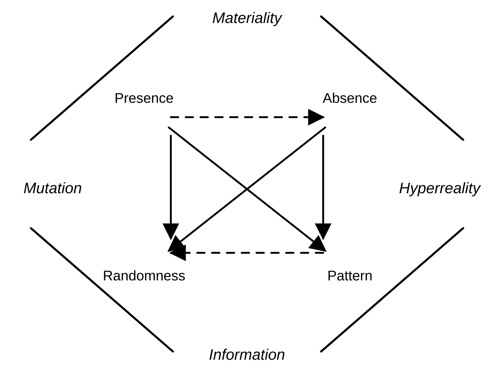

# clase-01

Jueves 6 de agosto de 2026

Profesor: Christian Oyarzun Roa
Correo: coyarzun@error404.cl

## Apuntes historia de la computacion

1. Reloj de péndulo de Galileo: Galileo Galilei estudió el movimiento regular del péndulo y propuso usarlo para medir el tiempo con mayor precisión. Hacia el final de su vida diseñó un mecanismo de reloj regulado por un péndulo, aunque no llegó a construir una versión funcional completa. Su idea fue un antecedente importante para los relojes de péndulo desarrollados posteriormente. Este punto permite pensar la mecanización del tiempo: un ritmo natural, como la oscilación del péndulo, se transforma en una unidad técnica, repetible y medible, capaz de organizar actividades humanas, trabajo, navegación, ciencia y vida cotidiana.

2. Pascalina (1642): Blaise Pascal diseñó una de las primeras calculadoras mecánicas para ayudar a su padre, recaudador de impuestos, a realizar sumas y restas. La máquina usaba ruedas dentadas y diales para representar números, mostrando cómo una operación matemática podía trasladarse a un mecanismo físico. La Pascalina es un antecedente clave en la historia de la computación porque automatiza el cálculo mediante una máquina.

3. Gottfried Leibniz y el sistema binario: Gottfried Wilhelm Leibniz desarrolló y difundió el sistema binario moderno, basado en solo dos símbolos: 0 y 1. En su texto sobre aritmética binaria, publicado en 1703, mostró que cualquier número podía representarse mediante combinaciones de estos dos valores. Este sistema es fundamental para la computación porque permite traducir información, operaciones lógicas e instrucciones a estados simples, como encendido/apagado o verdadero/falso.

4. Telares Jacquard (1801): Joseph Marie Jacquard desarrolló un telar que usaba tarjetas perforadas para controlar automáticamente los patrones del tejido. Cada tarjeta indicaba qué hilos debían levantarse o bajarse, convirtiendo una instrucción codificada en una acción mecánica. Este sistema es un antecedente directo de la programación porque separa las instrucciones de la máquina: al cambiar las tarjetas, cambia el resultado. En el contexto de la Revolución Industrial, el telar Jacquard muestra cómo la automatización de procesos permitió aumentar la producción, reducir tareas manuales repetitivas y transformar la relación entre trabajo, técnica y máquina.

5. Máquina Analítica de Charles Babbage (1816-1871): Charles Babbage diseñó la Máquina Analítica como una máquina mecánica de propósito general capaz de realizar cálculos siguiendo instrucciones. Aunque nunca fue construida completamente en su época, incorporaba ideas que luego serían centrales para la computación: memoria para almacenar datos, una unidad de cálculo, control mediante tarjetas perforadas y la posibilidad de ejecutar secuencias de operaciones. A diferencia de máquinas pensadas para una sola tarea, la Máquina Analítica anticipa la noción de computador programable.

6. Ada Lovelace y la primera programadora de la historia: Ada Lovelace estudió la Máquina Analítica de Babbage y escribió notas que iban más allá de la descripción técnica del aparato. En ellas propuso una secuencia de instrucciones para calcular números de Bernoulli, considerada uno de los primeros algoritmos pensados para ser ejecutados por una máquina. Su aporte también fue conceptual: imaginó que una máquina programable podía manipular símbolos y no solo números, abriendo la posibilidad de usar la computación para música, lenguaje u otras formas de creación.

7. George Boole y la lógica proposicional (1854): George Boole publicó *An Investigation of the Laws of Thought*, donde propuso representar razonamientos lógicos mediante operaciones matemáticas. Su sistema trabaja con valores de verdad, como verdadero/falso, y con operaciones como AND, OR y NOT. Esta lógica booleana es fundamental para la computación porque permite construir circuitos, condiciones y decisiones dentro de un programa, conectando el pensamiento lógico con sistemas técnicos que operan mediante estados binarios.

8. Tarjetas perforadas y procesamiento de datos (1890): Herman Hollerith usó tarjetas perforadas para procesar la información del censo de Estados Unidos de 1890. Cada perforación representaba un dato, como edad, sexo, ocupación o lugar de residencia, y las máquinas podían leer esas marcas para contar y clasificar información automáticamente. Este sistema transformó las tarjetas perforadas en una tecnología de almacenamiento y procesamiento de datos, anticipando formas posteriores de entrada de información en computadores.

9. Claude Shannon y el análisis simbólico de circuitos conmutadores y relés (1937): Claude Shannon demostró que la lógica booleana podía aplicarse al diseño de circuitos eléctricos con interruptores y relés. En su tesis, relacionó los valores verdadero/falso con estados físicos como abierto/cerrado o encendido/apagado. Este vínculo fue decisivo para la computación digital, porque mostró que el razonamiento lógico podía implementarse materialmente mediante circuitos, haciendo posible construir máquinas capaces de ejecutar operaciones lógicas.

10. ENIAC (1946): ENIAC (*Electronic Numerical Integrator and Computer*) fue uno de los primeros computadores electrónicos de propósito general. Construido en Estados Unidos, utilizaba miles de tubos de vacío para realizar cálculos a gran velocidad, especialmente cálculos balísticos y científicos. A diferencia de las máquinas mecánicas anteriores, ENIAC marca el paso hacia la computación electrónica: operaciones automáticas, procesamiento rápido de datos y programación mediante conexiones, interruptores y configuración física de la máquina.

11. Lo algorítmico: lo algorítmico es una forma de pensar y organizar acciones mediante instrucciones claras, ordenadas y repetibles. Un algoritmo no pertenece solo a la computación: también puede aparecer en una receta, una coreografía, una fórmula o una serie de pasos para resolver un problema. En términos computacionales, suele organizarse como entrada, proceso y salida: recibe datos, aplica reglas y produce un resultado. En programación creativa, lo algorítmico permite generar formas, sonidos, patrones o comportamientos visuales a partir de reglas.

12. Lo digital, lo discreto y lo analógico: lo digital trabaja con unidades discretas, es decir, valores separados y contables. Su opuesto es lo continuo o analógico, que se parece más a cómo percibimos muchos fenómenos de la realidad: el sonido cambia de forma gradual, la luz varía en intensidad, la humedad sube o baja sin saltos exactos. Para que un fenómeno de la vida real pueda entrar a un sistema computacional, debe transformarse en datos. Este paso suele ocurrir mediante dos procesos: primero, el muestreo, que toma mediciones en momentos o puntos específicos; segundo, la cuantización, que convierte esas mediciones en valores concretos dentro de una escala. Por ejemplo, un micrófono mide variaciones continuas de presión sonora y las transforma en muestras digitales; un sensor de humedad mide cambios del ambiente y los traduce a números que el computador puede guardar, comparar o procesar.

## Néstor Olhagaray

Néstor Olhagaray (Santiago, 1946-2020) fue un artista, académico y gestor cultural chileno, reconocido como una figura clave en el desarrollo del videoarte y las artes mediales en Chile. En 1993 fundó la Corporación Chilena de Video y Artes Electrónicas, desde donde impulsó espacios de creación, investigación y exhibición audiovisual.

Obra destacada: *Interview Story* (1988), videoarte de 6:07 minutos perteneciente a la Colección MAC. La obra utiliza imágenes y sonidos de circulación mediática para cuestionar la simulación, la manipulación y la construcción de sentido en la televisión y el contexto político de la época.

## Programación en BASIC

BASIC (*Beginner's All-purpose Symbolic Instruction Code*) es un lenguaje de programación diseñado para facilitar el aprendizaje inicial de la programación. En el contexto de la clase, permite introducir instrucciones, variables, operaciones, condiciones y ciclos de forma simple, conectando la computación con ejercicios matemáticos y procesos de resolución de problemas.

## Programación creativa

La programación creativa entiende el código como un medio de expresión, no solo como una herramienta funcional para resolver tareas. En lugar de buscar únicamente eficiencia, automatización o utilidad práctica, se enfoca en explorar posibilidades visuales, sonoras, interactivas y poéticas. Desde esta mirada, programar también puede ser dibujar, componer, experimentar y construir experiencias sensibles mediante reglas, instrucciones y sistemas.

## Referente: A. Michael Noll

A. Michael Noll es uno de los pioneros del arte computacional. Trabajó en Bell Labs desde comienzos de los años sesenta, donde exploró el uso de computadores digitales para producir imágenes, animación y experiencias interactivas. Su obra *Ninety Parallel Sinusoids with Linearly-Increasing Period* (1964) está compuesta por líneas sinusoidales paralelas cuyo período aumenta progresivamente. La imagen muestra cómo una forma visual puede ser generada por una regla matemática simple, conectando arte óptico, programación, cálculo y dibujo por computador.

## Referente: Frieder Nake

Frieder Nake es un artista, matemático y pionero del arte algorítmico. En *Hommage à Paul Klee, 13/9/65 Nr.2* (1965), Nake toma como referencia la pintura *Hauptweg und Nebenwege* (1929) de Paul Klee y la traduce a un sistema computacional de líneas, proporciones, grillas y círculos. La obra fue generada mediante un programa y dibujada con plotter, incorporando variables aleatorias dentro de una estructura definida. Su importancia está en mostrar que el computador no solo reproduce formas, sino que puede operar como medio creativo capaz de combinar regla, cálculo, azar y composición visual.

## Teoría del hipertexto

En *Hypertext: The Convergence of Contemporary Critical Theory and Technology* (1991), George P. Landow propone que el hipertexto transforma la lectura y la escritura al romper la linealidad del texto tradicional. En lugar de avanzar por una única secuencia fija, el lector navega entre fragmentos conectados por enlaces, construyendo su propio recorrido. Esta estructura descentralizada acerca la tecnología digital a ideas de la teoría crítica, como la multiplicidad de sentidos, la participación activa del lector y la idea de un texto abierto, relacional y no cerrado.

## Esquema: Semiotics of Virtuality

El esquema se basa en el artículo "Anacoustic Modes of Sound Construction and the Semiotics of Virtuality" de Robert Seaback, publicado en *Organised Sound* en 2020. Seaback usa ideas de N. Katherine Hayles para pensar la síntesis sonora como un modo anacústico: un sonido que no parte primero de una fuente acústica material, sino de información, código, reglas y estructuras digitales. Esto cambia la forma de entender el signo sonoro, porque el sonido digital puede existir inicialmente como patrón informacional antes de volverse experiencia audible. Desde esta mirada, la virtualidad no elimina la materialidad: la desplaza hacia la materialidad de la información, los sistemas técnicos y los procesos de escucha mediada por computador.

En el diagrama, la virtualidad se organiza entre dos grandes polos: materialidad e información. Dentro de ese campo aparecen las tensiones presencia/ausencia y azar/patrón. La mutación surge del cruce entre materialidad, presencia y azar; la hiperrealidad aparece cuando la ausencia y el patrón producen simulaciones capaces de operar como si fueran realidad. Este esquema ayuda a pensar el sonido digital como algo que puede moverse entre cuerpo, escucha, dato, síntesis, ruido y estructura.

## Antecedente en Chile: Cybersyn

Antes de la masificación de Internet y de las teorías del hipertexto de los años noventa, Chile tuvo un antecedente clave en el proyecto Synco o Cybersyn (1971-1973). Durante el gobierno de Salvador Allende, Fernando Flores, desde CORFO, contactó al cibernético británico Stafford Beer para pensar un sistema de gestión de información en tiempo casi real para las empresas estatales. El proyecto conectaba fábricas mediante una red de télex con un centro de procesamiento en Santiago, buscando apoyar la toma de decisiones económicas. Aunque no era hipertexto, sí anticipaba preguntas centrales de la cultura digital: redes de información, circulación de datos, interfaces de control y nuevas formas de organizar conocimiento mediante sistemas computacionales.

## Bibliografía

Harding, Inés y Michelow, Jaime. *Elementos de computación: la matemática del mundo contemporáneo*. Santiago: Editorial Universitaria, 1973.

Resumen breve: este libro introduce conceptos básicos de computación en un momento temprano del desarrollo informático en Chile. Presenta la computación como una herramienta matemática y técnica para procesar información, organizar instrucciones y comprender el funcionamiento de los computadores. Su importancia está en acercar estos conocimientos a estudiantes y lectores no especialistas, en un contexto donde la programación, las tarjetas perforadas y los primeros laboratorios computacionales comenzaban a incorporarse en la educación.

Landow, George P. *Hypertext: The Convergence of Contemporary Critical Theory and Technology*. Baltimore: Johns Hopkins University Press, 1991.

Hayles, N. Katherine. *How We Became Posthuman: Virtual Bodies in Cybernetics, Literature, and Informatics*. Chicago: University of Chicago Press, 1999.

Seaback, Robert. "Anacoustic Modes of Sound Construction and the Semiotics of Virtuality." *Organised Sound* 25, no. 1 (2020): 4-14. https://doi.org/10.1017/S1355771819000414.

Noll, A. Michael. *Ninety Parallel Sinusoids with Linearly-Increasing Period*. 1964. Computer-generated graphic, IBM 7094, Stromberg-Carlson SC4020 Microfilm Printer, FORTRAN.

Nake, Frieder. *Hommage à Paul Klee, 13/9/65 Nr.2*. 1965. Plotter drawing / silkscreen print, Zuse Graphomat Z64.

Maeda, John. *Design by Numbers*. Cambridge, MA: MIT Press, 1999.

Resumen breve: John Maeda propone la programación como una práctica visual y creativa. El libro introduce DBN (*Design by Numbers*), un lenguaje y entorno pensado para artistas y diseñadores, donde comandos simples permiten dibujar, repetir, variar y construir imágenes mediante código. Su aporte está en mostrar que programar no solo sirve para automatizar funciones, sino también para pensar formas, sistemas y procesos gráficos.
